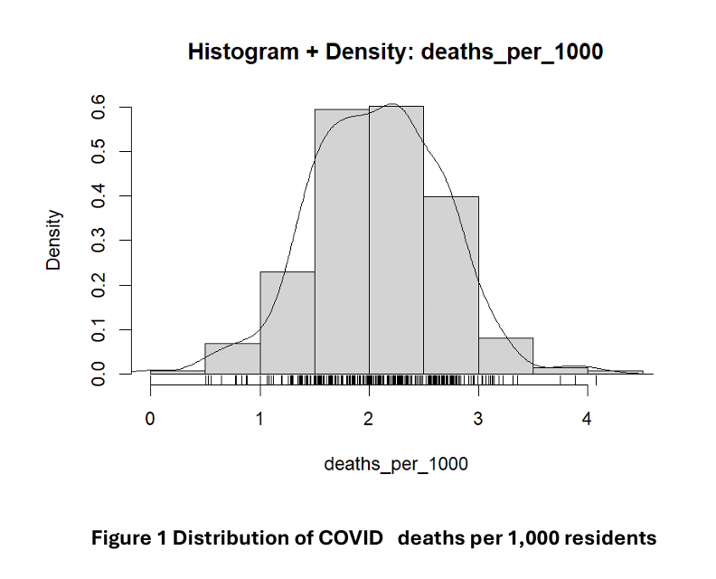
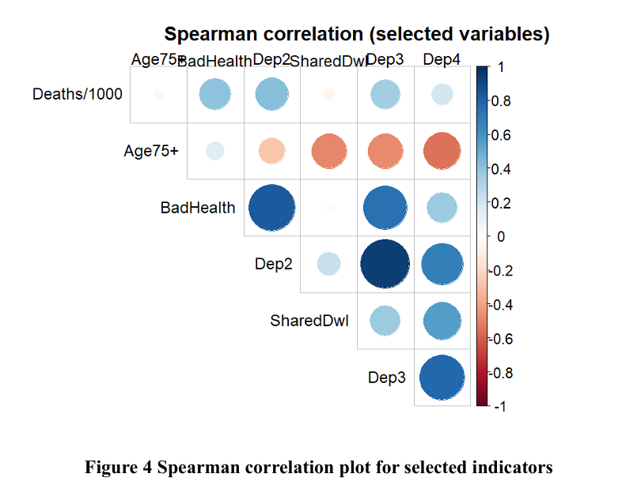
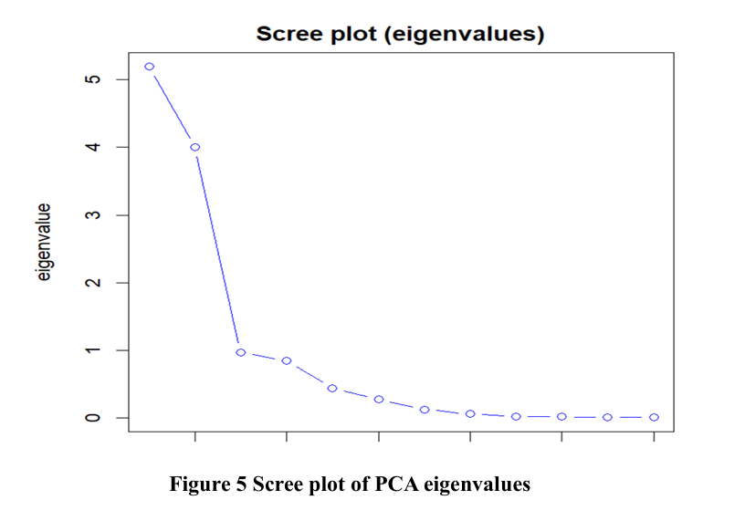

 # COVID-19 Mortality Analysis Across English Local Authorities

## Project Overview

This project investigates variation in COVID-19 mortality across English local authorities using demographic, health, deprivation and housing indicators.

The analysis combines SQL for data preparation with R for exploratory data analysis, correlation analysis, principal component analysis (PCA) and statistical modelling. The aim is to identify socioeconomic and demographic factors associated with differences in COVID-19 mortality between local authorities.

## Tools & Technologies

- SQL – data preparation and transformation
- R – statistical analysis and modelling
- Exploratory Data Analysis (EDA)
- Spearman Correlation
- Principal Component Analysis (PCA)
 - Multiple Regression

## Analysis

### COVID-19 Mortality Distribution

The distribution of COVID-19 deaths per 1,000 residents was examined to understand the overall variation in mortality across English local authorities.

### Correlation Analysis

Spearman correlation analysis was used to examine relationships between COVID-19 mortality and selected demographic, health, deprivation and housing indicators.

### Principal Component Analysis

PCA was used to investigate the underlying structure of the socioeconomic indicators and reduce correlated variables into a smaller number of components. The scree plot shows the eigenvalues associated with the principal components.

## Key Findings

- Household deprivation showed the strongest relationship with COVID-19 mortality. `dep2_per_1000_households` had the strongest bivariate association with deaths per 1,000 (Spearman's ρ = 0.422, p < 0.001).
- Poor health was also positively associated with mortality (Spearman's ρ = 0.401, p < 0.001), although its independent contribution reduced after deprivation was included in the multivariable model.
- The final regression model retained age 75+, household deprivation and unshared dwellings, explaining approximately 21.9% of the variation in COVID-19 deaths per 1,000 (R² = 0.2185).
- Household deprivation was the dominant predictor in the final model, accounting for approximately 82% of the model's explained variance.
- PCA showed substantial overlap between the socioeconomic indicators, with four components explaining approximately 92% of their cumulative variance.

## Repository Structure

- `data/` – project data
- `sql/` – SQL data preparation
- `r/` – R analysis code
- `images/` – analysis visualisations
- `report/` – full project report

## Key Skills Demonstrated

SQL · R · Data Cleaning · Exploratory Data Analysis · Statistical Analysis · Correlation Analysis · PCA · Data Visualisation

## Full Report

The complete academic report, including methodology, statistical analysis, results and discussion, is available in the `report/` folder.
